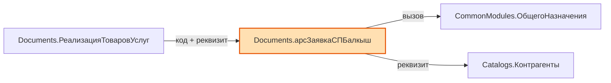

# Посредник | Broker1C2LLM

**Удобный инструмент-посредник** для работы с исходниками 1С:Предприятие 8.3 в файловом формате.

Быстро формирует карту конфигурации и позволяет извлекать нужные модули и структуры объектов в удобном Markdown-формате.

---

## Зачем нужен Посредник?

При работе с большой конфигурацией в файловом режиме часто требуется:
- Быстро понять структуру конфигурации
- Найти, где есть код, а где только XML
- Извлечь конкретные модули (Manager, Object, Form и т.д.)
- Получить структуру реквизитов, табличных частей, измерений и ресурсов

`Посредник` решает эти задачи за секунды.

---

## Возможности

### 1. Карта конфигурации (`СформироватьМД`)
- Проходит по **всем** объектам конфигурации, а не только по тем, у которых есть код
- Читает 45 видов метаданных: от справочников до подписок на события,
  функциональных опций, определяемых типов и общих команд
- Показывает синоним объекта — но только когда он отличается от имени,
  иначе карта распухает вдвое ни на чём
- Одной колонкой показывает, какие модули есть у объекта, метками,
  совпадающими с ключами `FETCH:`
- В шапке — имя, синоним, версия, поставщик и режим совместимости конфигурации
- Пропускает объекты, начинающиеся на `Удалить`
- Попутно строит кэш шапок, подписок и регистраторов — он ускоряет
  `SEARCH|syn` и `EVENTS:`

**Результат — два файла:**

| Файл | Что внутри |
|---|---|
| `ОсновнаяКонфигурация_*.md` | прикладные объекты |
| `ДополнительныеДанные_*.md` | роли, картинки, макеты, элементы стиля, XDTO-пакеты, языки |

Разделение сделано ради контекста чата: в УХ 21 770 объектов, и одним файлом
карта весит около 3 МБ. Основная карта — рабочий файл, дополнительная
запрашивается, когда нужного объекта в основной не нашлось.

### 2. Запросы к конфигурации (`ВыполнитьЗапрос`)

Поддерживает одиннадцать типов команд:

- **`FETCH:`** — извлечение исходного кода модулей целиком
- **`SCHEMA:`** — структура объекта: свойства, реквизиты, ТЧ, формы, команды,
  значения перечислений, предопределённые элементы, регистраторы
- **`SEARCH:`** — полнотекстовый поиск по именам, синонимам, коду и реквизитам
- **`DEPENDENCIES:`** — анализ зависимостей объекта с графом Mermaid
- **`OUTLINE:`** — оглавление модуля без выгрузки кода
- **`PROC:`** — одна процедура или функция целиком
- **`REGION:`** — одна область `#Область` целиком
- **`LINES:`** — произвольный диапазон строк модуля
- **`FORM:`** — реквизиты, параметры, команды и обработчики формы
- **`EVENTS:`** — подписки на события, где объект является источником
- **`SUBSYS:`** — состав подсистемы

Запросы можно слать пакетом по одному на строку. Каждый выполняется
изолированно: падение одного не отменяет остальные — в отчёт попадает блок
с текстом ошибки, а прочие результаты сохраняются.

#### Поддерживаемые типы объектов

Все 45 видов метаданных, встречающихся в выгрузке конфигуратора:

- CommonModules, Catalogs, Documents, DataProcessors, Reports
- InformationRegisters, AccumulationRegisters, AccountingRegisters, CalculationRegisters
- BusinessProcesses, Tasks, ExchangePlans, Sequences
- ChartsOfAccounts, ChartsOfCalculationTypes, ChartsOfCharacteristicTypes
- DocumentJournals, DocumentNumerators, WebServices, HTTPServices, WSReferences
- Constants, Enums, DefinedTypes, CommonAttributes
- CommonForms, CommonCommands, CommandGroups, FilterCriteria
- EventSubscriptions, ScheduledJobs, FunctionalOptions, FunctionalOptionsParameters
- SessionParameters, Subsystems, SettingsStorages, IntegrationServices
- ExternalDataSources, Bots
- Roles, CommonPictures, CommonTemplates, StyleItems, XDTOPackages, Languages
- плюс модули самой конфигурации (псевдотип `Configuration`)

**Важно.** Объект без модулей и форм лежит в выгрузке одним `.xml`-файлом,
без папки. Раньше обход шёл только по папкам, и такие объекты были не видны
ни карте, ни поиску — в УХ это, например, 1 465 перечислений из 1 723
и 890 констант из 989.

### 3. Осмысленные имена файлов

Имя результата собирается из самого запроса — по названию файла сразу видно,
что в нём лежит, и папка с выгрузками не превращается в кучу дат.

| Запрос | Файл результата |
|---|---|
| `SCHEMA:Catalogs.Контрагенты` | `Запрос_SCHEMA_Контрагенты.md` |
| `FETCH:Documents.РеализацияТоваров.object` | `Запрос_FETCH_РеализацияТоваров.md` |
| `SCHEMA:` по нескольким объектам | `Запрос_SCHEMA_A_B_C.md` |
| Больше трёх объектов | `Запрос_SCHEMA_A_B_C_и_ещё_5.md` |
| `FETCH:` и `SCHEMA:` в одном сеансе | `Запрос_FETCH-SCHEMA_ИмяОбъекта.md` |
| `SEARCH:ПодобратьДоговор` | `Запрос_SEARCH_ПодобратьДоговор.md` |
| `DEPENDENCIES:Catalogs.Контрагенты` | `Запрос_DEPS_Контрагенты.md` |
| `OUTLINE:CommonModules.РаботаСФайлами` | `Запрос_OUTLINE_РаботаСФайлами.md` |
| `PROC:CommonModules.РаботаСФайлами.ПрочитатьФайл` | `Запрос_PROC_ПрочитатьФайл.md` |
| `REGION:Documents.Реализация.object#ОбработчикиСобытий` | `Запрос_REGION_ОбработчикиСобытий.md` |
| `LINES:CommonModules.РаботаСФайлами.module:200-260` | `Запрос_LINES_РаботаСФайлами_200-260.md` |

### 4. Парсер SCHEMA

Возвращает таблицу «Реквизит — Тип — Раздел»:

```
| `Ref`                                | СправочникСсылка.Контрагенты | ⚙ Станд. реквизит |
| `Code`                               | Строка(9)                    | ⚙ Станд. реквизит |
| `ИНН`                                | Строка(12, фикс)             | ✏ Реквизит       |
| `Сумма`                              | Число(15,2)                  | ✏ Реквизит       |
| `ДополнительныеРеквизиты`            | ТабличнаяЧасть               | ☰ Таб. часть     |
| `ДополнительныеРеквизиты.Значение`   | Характеристика.ДопРеквизиты  | ✏ Реквизит       |
| `ФормаЭлемента`                      | Форма                        | ▣ Форма          |
| `SetContractStatus.POST`             | Метод                        | ⚒ Метод          |
```

Что умеет:

- **Квалификаторы типов** — `Строка(150)`, `Строка(12, фикс)`, `Число(15,2)`,
  `Дата(дата)`, `Дата(дата и время)`. Строка без скобок — неограниченной длины.
- **Составные типы** — через запятую, у каждого свой квалификатор:
  `Строка(100), СправочникСсылка.ФизическиеЛица`.
- **Табличные части** — реквизиты с префиксом (`Отдыхающие.НомерПутевки`),
  сама ТЧ строкой выше своих реквизитов. Поддерживается вложенность.
- **Типы-характеристики** — `<v8:TypeSet>` разворачивается в
  `Характеристика.ИмяПВХ`.
- **Стандартные реквизиты** типизированы: `Ref`, `Parent`, `Owner`, `Code`,
  `Description`, `Number`, `Date`, `Posted`, `DeletionMark`, `IsFolder`,
  `LineNumber`, `Period`, `Recorder`, `Active`, `RecordType`.
  Длины берутся из свойств объекта (`CodeLength`, `NumberLength`,
  `DescriptionLength`).
- **Формы и команды** выводятся поимённо — карта даёт только их количество.
- **Сервисы** — шаблоны URL, методы (с префиксом шаблона: `SendDocsSBIS.POST`)
  и операции веб-сервисов.
- **Иконки разделов** — `✏` реквизит, `◆` измерение, `Σ` ресурс,
  `⚙` станд. реквизит, `☰` таб. часть, `⊕` общий реквизит, `▣` форма,
  `▶` команда, `⇄` операция, `◈` шаблон URL, `⚒` метод.

Чего SCHEMA не показывает: `Код` и `Наименование` справочников отдельными
строками (в XML это свойства объекта, а не реквизиты — но их длины видны
в типах `Code` и `Description`), а также структуру констант.

### 5. Поиск по конфигурации (`SEARCH:`)

Находит текст сразу в трёх местах и возвращает готовые запросы для следующего шага.

```
SEARCH:текст|опция|опция
```

Разделитель — `|`, а не `:` или `;`, поэтому искомый текст может содержать и то,
и другое: `SEARCH:Отказ = Истина;|code` отработает как есть.

| Опция | Что делает |
|---|---|
| `name` | только имена объектов |
| `code` | только содержимое BSL |
| `attr` | только реквизиты и типы |
| `all` | все три (так же, если режим не указан) |
| `max=N` | лимит результатов, по умолчанию 50 |
| `in=Тип,Тип` | ограничить типами объектов |

Результат — до трёх таблиц, где последняя колонка содержит готовую строку
`FETCH:` или `SCHEMA:`: скопировал обратно в поле ввода — и получил код.

```
| Объект | Модуль | Строки | Запрос |
|---|---|---|---|
| `ChartsOfAccounts.Хозрасчетный` | command:ЖурналПроводок | 8 | `FETCH:ChartsOfAccounts.Хозрасчетный.command:ЖурналПроводок` |
| `Tasks.нмЗадача` | form:ФормаЗадачи | 42, 44, 46 | `FETCH:Tasks.нмЗадача.form:ФормаЗадачи` |
```

Что важно знать:

- Регистр игнорируется везде — и в именах, и в коде, и в реквизитах.
- Объекты с префиксом `Удалить` пропускаются, как и в карте конфигурации.
- Для каждого файла показывается до 5 номеров строк с вхождением.
- Поиск по реквизитам идёт вглубь табличных частей и по типу тоже:
  `SEARCH:СправочникСсылка.Контрагенты|attr` найдёт все реквизиты этого типа.
- По достижении `max` обход останавливается сразу, а не дочитывает объект.

**О скорости.** Полный `SEARCH:` без опций на крупной конфигурации читает
десятки тысяч `.bsl` — это минуты. На конфигурации в 9 000 объектов поиск
по коду в пределах `in=CommonModules` (около 4 000 модулей) занимает порядка
15 секунд, поиск по именам — секунды (файлы не читаются вообще).
Сужай через `in=` там, где понимаешь, где искать.

### 6. Анализ зависимостей (`DEPENDENCIES:`)

Показывает, что использует объект и кто использует его, плюс граф связей.

```
DEPENDENCIES:Тип.ИмяОбъекта|опция|опция
DEPS:Тип.ИмяОбъекта|опция              ← короткий алиас
```

| Опция | Что делает |
|---|---|
| `out` | только исходящие — кого использует объект |
| `rev` | только входящие — кто использует объект |
| `all` | оба направления (так же, если направление не указано) |
| `max=N` | лимит входящих связей, по умолчанию 100 |
| `in=Тип,Тип` | сузить обратный обход по типам объектов |

**Исходящие** считаются быстро — читаются только модули самого объекта:

- вызываемые общие модули — по сверке идентификатора перед точкой
  с реальным списком папок `CommonModules`, а не по догадке;
- объекты в реквизитах — из типов, с указанием, через какие именно реквизиты;
- обращения к менеджерам в коде — `Справочники.X`, `Документы.Y`,
  `РегистрыСведений.Z` и ещё 14 коллекций.

**Входящие** требуют обхода конфигурации, поэтому и существуют `in=` и `max=`:

- кто ссылается в коде — формы и команды видны отдельными строками
  через ключи `form:` / `command:`;
- кто ссылается реквизитами — включая попадание внутрь составных типов.

Пример графа в конце отчёта:

````

````

Что важно знать:

- Самоссылки отсекаются: объект не попадает в собственные списки ни через
  стандартный реквизит `Ref`, ни через обращение к своему же менеджеру.
- В графе не больше 12 узлов на группу, чтобы схема оставалась читаемой.
  Полный список всегда в таблицах выше.
- Если объект связан и кодом, и реквизитом, ребро подписывается
  `код + реквизит`, а не дублируется.
- В исходящем анализе комментарии отсекаются, поэтому упоминание под `//`
  в зависимости не попадёт. **В обратном обходе — нет:** там идёт поиск
  по файлу целиком, иначе пришлось бы разбирать на строки каждый файл
  конфигурации. Упоминание цели в чужом комментарии во входящие связи попадёт.
- Текст на языке запросов использует единственное число
  (`Справочник.Контрагенты`), а шаблоны — множественное
  (`Справочники.Контрагенты`), так что запросы в ложные срабатывания
  в основном не попадают.

### 7. Оглавление модуля (`OUTLINE:`)

Показывает, что лежит в модуле, не выгружая сам код. Нужен там, где модуль
слишком велик, чтобы тянуть его целиком: сначала смотрим оглавление, потом
берём точечно нужный кусок.

```
OUTLINE:Тип.ИмяОбъекта
OUTLINE:Тип.ИмяОбъекта.модуль
OUTLINE:Тип.ИмяОбъекта|опция
```

| Опция | Что делает |
|---|---|
| `export` | только экспортные процедуры и функции |
| `marks` | только методы с маркерами доработок `//+` и полный их список |
| `find=подстрока` | только методы, в имени которых есть подстрока |
| `noregion` | только методы, лежащие вне всяких `#Область` |
| `page=N` | страница таблицы, если она не влезла в лимит |
| `all` | без ограничений: все модули объекта и вся таблица целиком |

Область можно указать прямо в адресе — тогда в таблицу попадёт только её
содержимое:

```
OUTLINE:CommonModules.арсОбщийМодульСервер.module#ОбработчикиПодписокНаСобытия
```

Что попадает в таблицу:

- **Области** `#Область` — с диапазоном строк и вложенностью (уровень показан
  отступом `·`);
- **Процедуры и функции** — имя, вид, признак экспорта, директива компиляции
  (и аннотация расширения — `&Вместо`, `&После`, `&ИзменениеИКонтроль`),
  параметры, границы строк;
- **Маркеры** `//+Арсансофт ФИО Дата №Задача` — счётчик в основной таблице
  и отдельная таблица с номером строки и привязкой к процедуре.

Последняя колонка — готовый `PROC:` или `LINES:` для точечного дозапроса.

```
| Строки | Элемент | Вид | Директива | Параметры | Марк. | Запрос |
|---|---|---|---|---|---|---|
| 1-31 | **#Область ПрограммныйИнтерфейс** | Область |  |  |  | `LINES:...module:1-31` |
| 3-18 | · `ПолучитьСтатус` | Функция ✓экспорт | &НаСервере | Знач Ссылка | 1 | `PROC:...module#ПолучитьСтатус` |
```

Если у объекта больше двух модулей, `OUTLINE:` без указания модуля сначала
отдаёт сводку — сколько в каждом модуле строк, областей, процедур — с готовым
`OUTLINE:` на каждый. Нужны все сразу — добавь `|all`.

#### Ограничения на размер

Оглавление модуля на 100 000 строк само по себе неподъёмно, поэтому:

- если элементов больше 250, вместо полной таблицы выводится **сводка
  по областям верхнего уровня** — строки, число процедур, экспортных
  и маркеров, плюс готовый `OUTLINE:...#ИмяОбласти` на каждую и строка
  «вне областей» для методов, лежащих вне всяких `#Область`;
- отобранная таблица режется на страницы по 250 строк: внизу указано, какая
  страница показана и готовый запрос на следующую (`|page=2`);
- список маркеров печатается автоматически, только если их не больше 60;
  иначе выводится счётчик и запрос `|marks`. При `|export`, `|find=`,
  `|noregion` и отборе по области маркеры считаются только по отобранным
  методам, и предлагаемый запрос сохраняет текущий отбор;
- в режиме `|marks` таблица методов не печатается — выводится только список
  маркеров, страницами по 300.

Любое ограничение снимается опцией `|all`.

### 8. Точечное извлечение кода (`PROC:` / `REGION:` / `LINES:`)

Три команды достают из модуля ровно то, что нужно, вместо всего файла.

```
PROC:Тип.ИмяОбъекта.ИмяПроцедуры
PROC:Тип.ИмяОбъекта.модуль#ИмяПроцедуры
REGION:Тип.ИмяОбъекта.модуль#ИмяОбласти
LINES:Тип.ИмяОбъекта.модуль:20180-20240
```

**`PROC:`** отдаёт процедуру или функцию целиком, вместе с шапкой: директивой
компиляции, аннотацией расширения и предшествующими комментариями — включая
маркеры `//+Арсансофт`. Модуль указывать не обязательно: без него команда
просматривает все модули объекта. Если одноимённые процедуры нашлись
в нескольких модулях (`ПриСозданииНаСервере` в тринадцати формах), выдаётся
не первая попавшаяся, а таблица вариантов с готовыми запросами:

```
| Модуль | Область | Строки | Запрос |
|---|---|---|---|
| `form:ФормаДокумента` | — | 12-48 | `PROC:Documents.Реализация.form:ФормаДокумента#ПриСозданииНаСервере` |
| `form:ФормаСписка` | — | 8-26 | `PROC:Documents.Реализация.form:ФормаСписка#ПриСозданииНаСервере` |
```

Нужны все сразу — `|all`.

**`REGION:`** отдаёт область целиком, вместе со строками `#Область`
и `#КонецОбласти`. Вложенные области попадают внутрь, как и в конфигураторе.

**`LINES:`** отдаёт точный диапазон строк — то, что нужно, когда номера строк
уже известны из `SEARCH:` или `OUTLINE:`. Модуль обязателен, если их у объекта
несколько. Конец диапазона за пределами файла обрезается по последней строке.
Если начало диапазона попало внутрь процедуры, в шапке будет её имя
и готовый `PROC:`, чтобы добрать метод целиком.

У каждого фрагмента есть шапка «объект / модуль / область / строки»:

```
> Объект: `CommonModules.арсИнтеграцияThermalConnect` / Модуль: `module` (Module)
> / Область: `ПрограммныйИнтерфейс` / Строки: 3-18 из 969
```

Разделители намеренно разные: `#` отделяет имя внутри модуля, `:` — диапазон
строк, поэтому ключ формы `form:ФормаДокумента` не путается с диапазоном.

---

## Как использовать

1. Скачай `Посредник`
2. Открой в 1С как внешнюю обработку
3. Укажи путь к корню выгруженной конфигурации
4. Запусти нужную команду

### Примеры запросов

```text
FETCH:Catalogs.Контрагенты.all

FETCH:Documents.РеализацияТоваровУслуг.object,manager

FETCH:DataProcessors.ЗагрузкаДанных.form:ОсновнаяФорма

SCHEMA:Catalogs.Номенклатура

SCHEMA:HTTPServices.arsDirectumExchange

SEARCH:ПодобратьДоговор

SEARCH:ПодобратьДоговор|code|in=CommonModules,Documents

SEARCH:СправочникСсылка.арсРодственники|attr|in=Documents

DEPS:Documents.РеализацияТоваровУслуг|out

DEPS:Catalogs.Контрагенты|rev|in=Documents|max=50

OUTLINE:CommonModules.арсИнтеграцияThermalConnect

OUTLINE:Documents.РеализацияТоваровУслуг.object|export

OUTLINE:CommonModules.арсОбщийМодульСервер.module#ОбработчикиПодписокНаСобытия

OUTLINE:CommonModules.арсОбщийМодульСервер|find=Автопостинг

PROC:CommonModules.арсОбщийМодульСервер_Документы.ПолучениеСтатусаДокументаEHS

PROC:Documents.РеализацияТоваровУслуг.form:ФормаДокумента#ПриСозданииНаСервере

REGION:Documents.ПоступлениеТоваровУслуг.object#ОбработчикиСобытий

LINES:CommonModules.арсОбщийМодульСервер.module:20180-20240

FETCH:CommonModules.РаботаСДокументами.module;SCHEMA:AccumulationRegisters.ПродажиТоваров
```

---

## Структура проекта

```
/
├── Посредник                  ← Основной скрипт
├── 1C_INSTRUCTIONS.md         ← Инструкция для ИИ (Grok, GPT и др.)
├── README.md                  ← Этот файл
└── examples/                  ← (опционально) примеры запросов
```

---

## Рекомендуемый workflow с ИИ

1. Сгенерируй **Карту конфигурации**
2. Прикрепи файл карты конфигурации и скилл для работы с инструментом [`1C_INSTRUCTIONS.md`](1C_INSTRUCTIONS.md) к чату с ИИ
3. Опиши задачу
4. ИИ выдаст готовые `FETCH:` / `SCHEMA:` запросы
5. Выполни их через Посредник
6. Прикрепи полученный `Запрос_....md` обратно в чат

Если непонятно, с какого объекта начинать, — начни с `SEARCH:`, а уже из его
таблицы бери готовые `FETCH:` / `SCHEMA:`. А если нужно понять, что сломается
при правке объекта, — `DEPENDENCIES:` покажет и то, что он использует,
и тех, кто зависит от него.

Для крупных модулей маршрут другой и стоит дешевле:
`OUTLINE:` (что вообще есть в модуле) → `PROC:` или `LINES:` (только нужный
кусок). Тянуть `FETCH:` на модуль в 20 000 строк, чтобы посмотреть тридцать
из них, больше не нужно.

Подробная инструкция — в файле [`1C_INSTRUCTIONS.md`](1C_INSTRUCTIONS.md).

---

## Планы развития

- [ ] Поддержка сравнения с git (что изменилось)
- [ ] Web-версия / VS Code extension
- [x] Реквизиты форм (`FORM:`) и параметры операций веб-сервисов в SCHEMA
- [x] Синтез строк `Код` / `Наименование` для справочников
- [x] Полный обход конфигурации: все 45 видов метаданных, объекты без папок
- [x] Синонимы объектов и реквизитов в карте и в SCHEMA
- [x] Значения перечислений и предопределённые элементы в SCHEMA
- [x] Поиск по синонимам и подсказкам (`SEARCH|syn`)
- [x] Подписки на события по объекту (`EVENTS:`) и состав подсистемы (`SUBSYS:`)
- [x] Изоляция запросов в пакете: ошибка одного не отменяет остальные
- [x] Типы стандартных реквизитов планов счетов, планов обмена,
      бизнес-процессов, задач и регистров расчёта
- [x] Осмысленные имена файлов результата
- [x] Улучшенный парсер SCHEMA (квалификаторы, составные типы, иконки)
- [x] Полнотекстовый поиск по коду, именам и реквизитам (`SEARCH:`)
- [x] Анализ зависимостей между объектами с графом Mermaid (`DEPENDENCIES:`)
- [x] Оглавление модуля без выгрузки кода (`OUTLINE:`)
- [x] Точечное извлечение процедур, областей и диапазонов строк
      (`PROC:` / `REGION:` / `LINES:`)

---

## Лицензия

MIT License — свободное использование и доработка.
