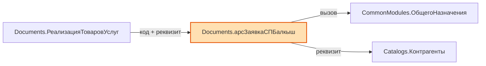

# Посредник | Broker1C2LLM

**Удобный инструмент-посредник** для работы с исходниками 1С:Предприятие 8.3 в файловом формате.

Быстро формирует карту конфигурации и позволяет извлекать нужные модули и структуры объектов в удобном Markdown-формате.

---

## Зачем нужен Посредник?

При работе с большой конфигурацией в файловом режиме часто требуется:
- Быстро понять структуру конфигурации
- Найти, где есть код, а где только XML
- Извлечь конкретные модули (Manager, Object, Form и т.д.)
- Получить структуру реквизитов, табличных частей, измерений и ресурсов

`Посредник` решает эти задачи за секунды.

---

## Возможности

### 1. Карта конфигурации (`СформироватьМД`)
- Проходит по всем объектам конфигурации
- Показывает наличие модулей, форм и команд
- Пропускает объекты, начинающиеся на `Удалить`
- Формирует красивую Markdown-таблицу

**Результат:** `КартаКонфигурации_ГГГГ-ММ-ДД_ЧЧ-ММ-СС.md`

### 2. Запросы к конфигурации (`ВыполнитьЗапрос`)

Поддерживает четыре типа команд:

- **`FETCH:`** — извлечение исходного кода модулей
- **`SCHEMA:`** — извлечение структуры объекта (реквизиты, ТЧ, формы, команды)
- **`SEARCH:`** — полнотекстовый поиск по конфигурации
- **`DEPENDENCIES:`** — анализ зависимостей объекта с графом Mermaid

#### Поддерживаемые типы объектов
- CommonModules, Catalogs, Documents, DataProcessors, Reports
- InformationRegisters, AccumulationRegisters, AccountingRegisters, CalculationRegisters
- BusinessProcesses, Tasks, ExchangePlans
- ChartsOfAccounts, ChartsOfCalculationTypes, ChartsOfCharacteristicTypes
- DocumentJournals, WebServices, HTTPServices, Constants, Enums и др.

### 3. Осмысленные имена файлов

Имя результата собирается из самого запроса — по названию файла сразу видно,
что в нём лежит, и папка с выгрузками не превращается в кучу дат.

| Запрос | Файл результата |
|---|---|
| `SCHEMA:Catalogs.Контрагенты` | `Запрос_SCHEMA_Контрагенты.md` |
| `FETCH:Documents.РеализацияТоваров.object` | `Запрос_FETCH_РеализацияТоваров.md` |
| `SCHEMA:` по нескольким объектам | `Запрос_SCHEMA_A_B_C.md` |
| Больше трёх объектов | `Запрос_SCHEMA_A_B_C_и_ещё_5.md` |
| `FETCH:` и `SCHEMA:` в одном сеансе | `Запрос_FETCH-SCHEMA_ИмяОбъекта.md` |
| `SEARCH:ПодобратьДоговор` | `Запрос_SEARCH_ПодобратьДоговор.md` |
| `DEPENDENCIES:Catalogs.Контрагенты` | `Запрос_DEPS_Контрагенты.md` |

### 4. Парсер SCHEMA

Возвращает таблицу «Реквизит — Тип — Раздел»:

```
| `Ref`                                | СправочникСсылка.Контрагенты | ⚙ Станд. реквизит |
| `Code`                               | Строка(9)                    | ⚙ Станд. реквизит |
| `ИНН`                                | Строка(12, фикс)             | ✏ Реквизит       |
| `Сумма`                              | Число(15,2)                  | ✏ Реквизит       |
| `ДополнительныеРеквизиты`            | ТабличнаяЧасть               | ☰ Таб. часть     |
| `ДополнительныеРеквизиты.Значение`   | Характеристика.ДопРеквизиты  | ✏ Реквизит       |
| `ФормаЭлемента`                      | Форма                        | ▣ Форма          |
| `SetContractStatus.POST`             | Метод                        | ⚒ Метод          |
```

Что умеет:

- **Квалификаторы типов** — `Строка(150)`, `Строка(12, фикс)`, `Число(15,2)`,
  `Дата(дата)`, `Дата(дата и время)`. Строка без скобок — неограниченной длины.
- **Составные типы** — через запятую, у каждого свой квалификатор:
  `Строка(100), СправочникСсылка.ФизическиеЛица`.
- **Табличные части** — реквизиты с префиксом (`Отдыхающие.НомерПутевки`),
  сама ТЧ строкой выше своих реквизитов. Поддерживается вложенность.
- **Типы-характеристики** — `<v8:TypeSet>` разворачивается в
  `Характеристика.ИмяПВХ`.
- **Стандартные реквизиты** типизированы: `Ref`, `Parent`, `Owner`, `Code`,
  `Description`, `Number`, `Date`, `Posted`, `DeletionMark`, `IsFolder`,
  `LineNumber`, `Period`, `Recorder`, `Active`, `RecordType`.
  Длины берутся из свойств объекта (`CodeLength`, `NumberLength`,
  `DescriptionLength`).
- **Формы и команды** выводятся поимённо — карта даёт только их количество.
- **Сервисы** — шаблоны URL, методы (с префиксом шаблона: `SendDocsSBIS.POST`)
  и операции веб-сервисов.
- **Иконки разделов** — `✏` реквизит, `◆` измерение, `Σ` ресурс,
  `⚙` станд. реквизит, `☰` таб. часть, `⊕` общий реквизит, `▣` форма,
  `▶` команда, `⇄` операция, `◈` шаблон URL, `⚒` метод.

Чего SCHEMA не показывает: `Код` и `Наименование` справочников отдельными
строками (в XML это свойства объекта, а не реквизиты — но их длины видны
в типах `Code` и `Description`), а также структуру констант.

### 5. Поиск по конфигурации (`SEARCH:`)

Находит текст сразу в трёх местах и возвращает готовые запросы для следующего шага.

```
SEARCH:текст|опция|опция
```

Разделитель — `|`, а не `:` или `;`, поэтому искомый текст может содержать и то,
и другое: `SEARCH:Отказ = Истина;|code` отработает как есть.

| Опция | Что делает |
|---|---|
| `name` | только имена объектов |
| `code` | только содержимое BSL |
| `attr` | только реквизиты и типы |
| `all` | все три (так же, если режим не указан) |
| `max=N` | лимит результатов, по умолчанию 50 |
| `in=Тип,Тип` | ограничить типами объектов |

Результат — до трёх таблиц, где последняя колонка содержит готовую строку
`FETCH:` или `SCHEMA:`: скопировал обратно в поле ввода — и получил код.

```
| Объект | Модуль | Строки | Запрос |
|---|---|---|---|
| `ChartsOfAccounts.Хозрасчетный` | command:ЖурналПроводок | 8 | `FETCH:ChartsOfAccounts.Хозрасчетный.command:ЖурналПроводок` |
| `Tasks.нмЗадача` | form:ФормаЗадачи | 42, 44, 46 | `FETCH:Tasks.нмЗадача.form:ФормаЗадачи` |
```

Что важно знать:

- Регистр игнорируется везде — и в именах, и в коде, и в реквизитах.
- Объекты с префиксом `Удалить` пропускаются, как и в карте конфигурации.
- Для каждого файла показывается до 5 номеров строк с вхождением.
- Поиск по реквизитам идёт вглубь табличных частей и по типу тоже:
  `SEARCH:СправочникСсылка.Контрагенты|attr` найдёт все реквизиты этого типа.
- По достижении `max` обход останавливается сразу, а не дочитывает объект.

**О скорости.** Полный `SEARCH:` без опций на крупной конфигурации читает
десятки тысяч `.bsl` — это минуты. На конфигурации в 9 000 объектов поиск
по коду в пределах `in=CommonModules` (около 4 000 модулей) занимает порядка
15 секунд, поиск по именам — секунды (файлы не читаются вообще).
Сужай через `in=` там, где понимаешь, где искать.

### 6. Анализ зависимостей (`DEPENDENCIES:`)

Показывает, что использует объект и кто использует его, плюс граф связей.

```
DEPENDENCIES:Тип.ИмяОбъекта|опция|опция
DEPS:Тип.ИмяОбъекта|опция              ← короткий алиас
```

| Опция | Что делает |
|---|---|
| `out` | только исходящие — кого использует объект |
| `rev` | только входящие — кто использует объект |
| `all` | оба направления (так же, если направление не указано) |
| `max=N` | лимит входящих связей, по умолчанию 100 |
| `in=Тип,Тип` | сузить обратный обход по типам объектов |

**Исходящие** считаются быстро — читаются только модули самого объекта:

- вызываемые общие модули — по сверке идентификатора перед точкой
  с реальным списком папок `CommonModules`, а не по догадке;
- объекты в реквизитах — из типов, с указанием, через какие именно реквизиты;
- обращения к менеджерам в коде — `Справочники.X`, `Документы.Y`,
  `РегистрыСведений.Z` и ещё 14 коллекций.

**Входящие** требуют обхода конфигурации, поэтому и существуют `in=` и `max=`:

- кто ссылается в коде — формы и команды видны отдельными строками
  через ключи `form:` / `command:`;
- кто ссылается реквизитами — включая попадание внутрь составных типов.

Пример графа в конце отчёта:

````

````

Что важно знать:

- Самоссылки отсекаются: объект не попадает в собственные списки ни через
  стандартный реквизит `Ref`, ни через обращение к своему же менеджеру.
- В графе не больше 12 узлов на группу, чтобы схема оставалась читаемой.
  Полный список всегда в таблицах выше.
- Если объект связан и кодом, и реквизитом, ребро подписывается
  `код + реквизит`, а не дублируется.
- В исходящем анализе комментарии отсекаются, поэтому упоминание под `//`
  в зависимости не попадёт. **В обратном обходе — нет:** там идёт поиск
  по файлу целиком, иначе пришлось бы разбирать на строки каждый файл
  конфигурации. Упоминание цели в чужом комментарии во входящие связи попадёт.
- Текст на языке запросов использует единственное число
  (`Справочник.Контрагенты`), а шаблоны — множественное
  (`Справочники.Контрагенты`), так что запросы в ложные срабатывания
  в основном не попадают.

---

## Как использовать

1. Скачай `Посредник`
2. Открой в 1С как внешнюю обработку
3. Укажи путь к корню выгруженной конфигурации
4. Запусти нужную команду

### Примеры запросов

```text
FETCH:Catalogs.Контрагенты.all

FETCH:Documents.РеализацияТоваровУслуг.object,manager

FETCH:DataProcessors.ЗагрузкаДанных.form:ОсновнаяФорма

SCHEMA:Catalogs.Номенклатура

SCHEMA:HTTPServices.arsDirectumExchange

SEARCH:ПодобратьДоговор

SEARCH:ПодобратьДоговор|code|in=CommonModules,Documents

SEARCH:СправочникСсылка.арсРодственники|attr|in=Documents

DEPS:Documents.РеализацияТоваровУслуг|out

DEPS:Catalogs.Контрагенты|rev|in=Documents|max=50

FETCH:CommonModules.РаботаСДокументами.module;SCHEMA:AccumulationRegisters.ПродажиТоваров
```

---

## Структура проекта

```
/
├── Посредник                  ← Основной скрипт
├── 1C_INSTRUCTIONS.md         ← Инструкция для ИИ (Grok, GPT и др.)
├── README.md                  ← Этот файл
└── examples/                  ← (опционально) примеры запросов
```

---

## Рекомендуемый workflow с ИИ

1. Сгенерируй **Карту конфигурации**
2. Прикрепи файл карты конфигурации и скилл для работы с инструментом [`1C_INSTRUCTIONS.md`](1C_INSTRUCTIONS.md) к чату с ИИ
3. Опиши задачу
4. ИИ выдаст готовые `FETCH:` / `SCHEMA:` запросы
5. Выполни их через Посредник
6. Прикрепи полученный `Запрос_....md` обратно в чат

Если непонятно, с какого объекта начинать, — начни с `SEARCH:`, а уже из его
таблицы бери готовые `FETCH:` / `SCHEMA:`. А если нужно понять, что сломается
при правке объекта, — `DEPENDENCIES:` покажет и то, что он использует,
и тех, кто зависит от него.

Подробная инструкция — в файле [`1C_INSTRUCTIONS.md`](1C_INSTRUCTIONS.md).

---

## Планы развития

- [ ] Поддержка сравнения с git (что изменилось)
- [ ] Web-версия / VS Code extension
- [ ] Реквизиты форм и параметры операций веб-сервисов в SCHEMA
- [ ] Синтез строк `Код` / `Наименование` для справочников
- [x] Осмысленные имена файлов результата
- [x] Улучшенный парсер SCHEMA (квалификаторы, составные типы, иконки)
- [x] Полнотекстовый поиск по коду, именам и реквизитам (`SEARCH:`)
- [x] Анализ зависимостей между объектами с графом Mermaid (`DEPENDENCIES:`)

---

## Лицензия

MIT License — свободное использование и доработка.
